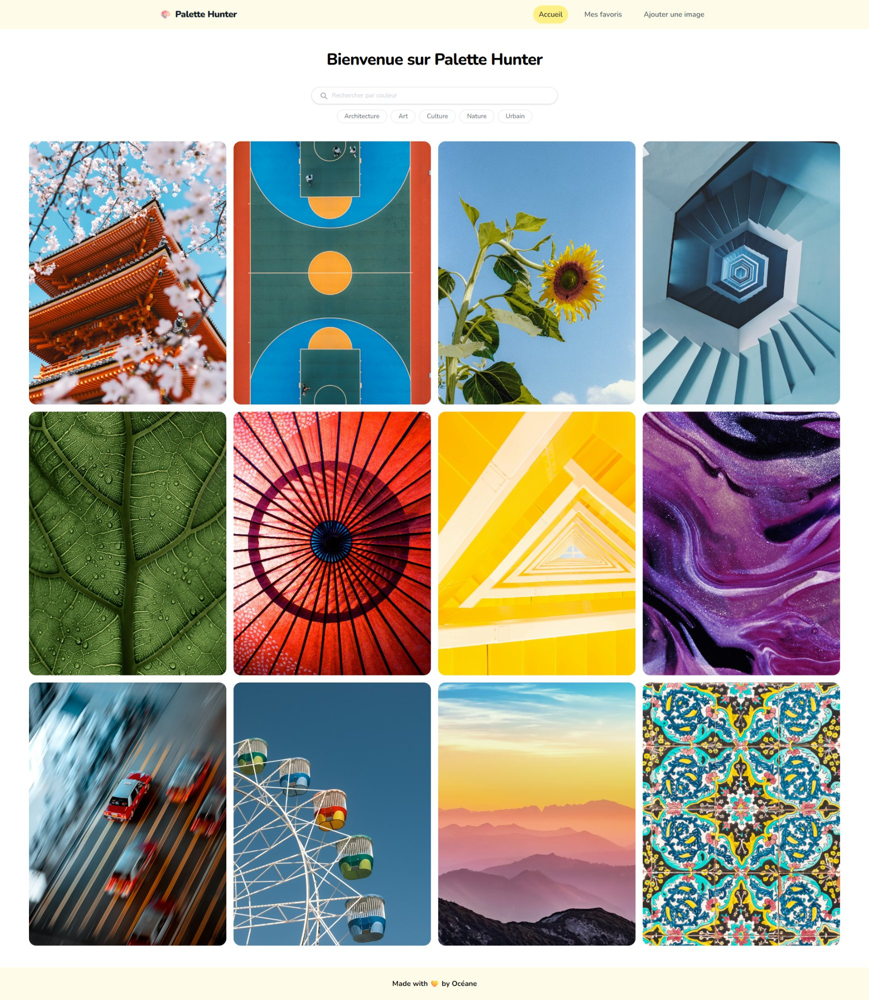

# 🎨 Palette Hunter

Palette Hunter est une application web fullstack permettant de découvrir des images et leurs palettes de couleurs. On peut rechercher des images par couleur via un color picker, filtrer par tag, consulter leurs palettes, ajouter ses propres images et sauvegarder ses favoris.



---

## 🛠️ Stack technique

- **Frontend** : React, TypeScript, Tailwind CSS, React Router
- **Backend** : Node.js, Express
- **Base de données** : PostgreSQL (Neon)

---

## 📁 Structure du projet

```
palette-hunter/
├── back/
│   ├── index.js
│   └── routes/
│       ├── images.js
│       ├── palettes.js
│       └── favoris.js
└── front/
    └── src/
        ├── components/
        │   ├── Navbar.tsx
        │   ├── ImageGrid.tsx
        │   ├── SearchBar.tsx
        │   └── Footer.tsx
        └── pages/
            ├── HomePage.tsx
            ├── ImagePage.tsx
            ├── FavoritesPage.tsx
            └── AddImagePage.tsx
```

---

## 🚀 Installation

### Prérequis

- Node.js
- Un compte [Neon](https://neon.tech) pour la base de données

### Backend

```bash
cd back
npm install
```

Crée un fichier `.env` à la racine du dossier `back` :

```
DATABASE_URL=ta_url_neon
PORT=4242
```

Lance le serveur :

```bash
node index.js
```

### Frontend

```bash
cd front
npm install
npm run dev
```

L'application est accessible sur `http://localhost:5173`

---

## 🗄️ Base de données

La base de données contient 3 tables :

- **images** : les images avec leur titre, description, url, source, tag et couleurs dominantes
- **palettes** : les palettes de couleurs associées à chaque image (codes hexadécimaux)
- **favoris** : les images sauvegardées en favori

---

## 📡 Routes API

### Images

| Méthode | Route                              | Description                                   |
| ------- | ---------------------------------- | --------------------------------------------- |
| GET     | `/images`                          | Récupère toutes les images                    |
| GET     | `/images/search?colors=Rouge,Bleu` | Recherche des images par nom de couleur       |
| GET     | `/images/color?hex=%23ff0000`      | Recherche des images par couleur hexadécimale |
| GET     | `/images/tags`                     | Récupère tous les tags distincts              |
| GET     | `/images/tag/:tag`                 | Filtre les images par tag                     |
| GET     | `/images/:id`                      | Récupère une image et sa palette              |
| POST    | `/images`                          | Ajoute une nouvelle image                     |

#### Body pour POST `/images`

```json
{
  "title": "Mon image",
  "description": "Une description",
  "url": "https://monimage.com/photo.jpg",
  "source": "Unsplash",
  "tag": "nature",
  "dominant_colors": ["Rouge", "Bleu", "Vert"]
}
```

### Palettes

| Méthode | Route       | Description                    |
| ------- | ----------- | ------------------------------ |
| POST    | `/palettes` | Ajoute une palette à une image |

#### Body pour POST `/palettes`

```json
{
  "image_id": 1,
  "colors": ["#C9BECC", "#82CCEC", "#BA3303", "#F0A644", "#1D0F04"]
}
```

### Favoris

| Méthode | Route          | Description                  |
| ------- | -------------- | ---------------------------- |
| GET     | `/favoris`     | Récupère tous les favoris    |
| POST    | `/favoris`     | Ajoute une image aux favoris |
| DELETE  | `/favoris/:id` | Supprime un favori           |

#### Body pour POST `/favoris`

```json
{
  "image_id": 1
}
```

---

## 📄 Pages

| URL           | Description                                                      |
| ------------- | ---------------------------------------------------------------- |
| `/`           | Mosaïque d'images + recherche par couleur + filtres par tag      |
| `/images/:id` | Détail d'une image avec sa palette cliquable + ajout aux favoris |
| `/favoris`    | Liste des images favorites avec suppression                      |
| `/ajouter`    | Formulaire d'ajout d'une nouvelle image avec sa palette          |

---

_Made with 💛 by Océane_
